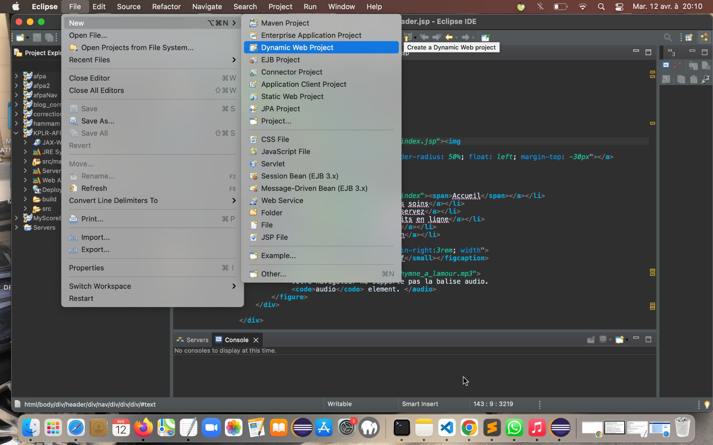
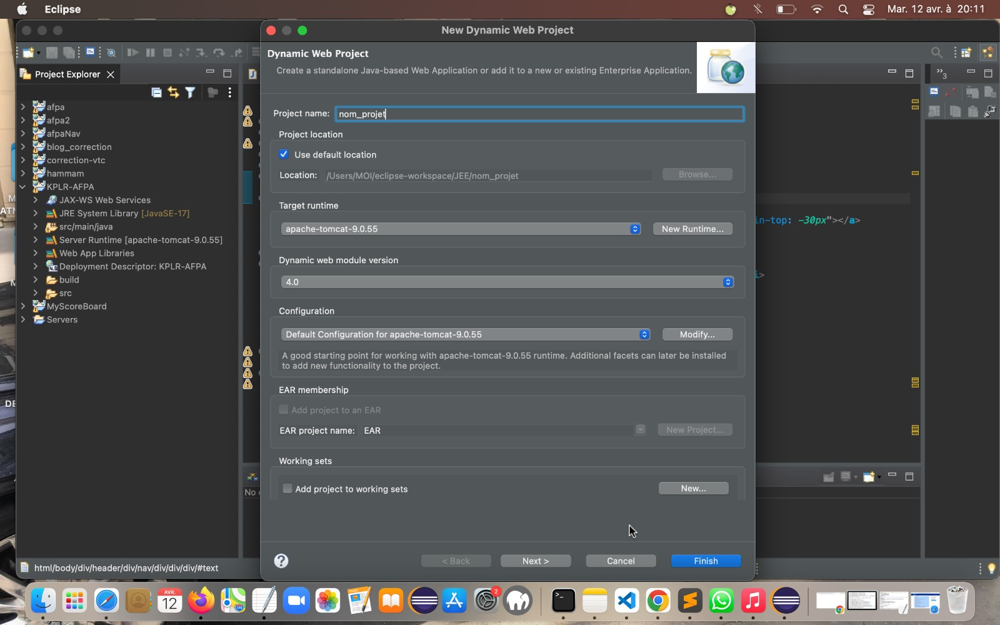
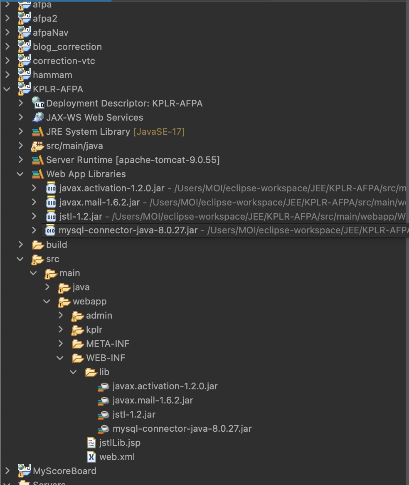

# Projet kplr-afpa
## _Création de site web vitrine_

##### Réalisé par Shabina Abdoul et Aisha Mimouni pour l'Afpa Paris, formation CDA (Conception, Développement d'applications).
Formateur Moussa Camara.</br>
Directeur de stage Nabil El Karmouni.</br>

Le site web KPLR est un site de présentation des activités de la sociétés KPLR, basée à Marseille, Paris et Casablanca, avec deux axes centrales, à savoir le conseil et la formation.

- Langage Java EE 
- IDE Eclipse (v 12.21)
- Pile Mamp/Wamp :
- Database : MySQL/PhpMyAdmin (last V)
- Serveur : apache-tomcat-9.0.55
	https://archive.apache.org/dist/tomcat/tomcat-9/v9.0.55/bin/
- kplr_afpa .sql

## Features

- Dans Eclipse, créer un web dynamic project.



- Le nommer : kplr-afpa (nomination au choix).



- Dans le folder 'deployment descriptor, clik-droit et choisir: générer un 'deployment generate desriptor stub'.
- Un fichier .xml est généré dans le dossier 'WEB-INF' de la WebApp.
- Le contenu généré par ce fichier .xml sera par défaut :
```xml
<?xml version="1.0" encoding="UTF-8"?>
<web-app xmlns:xsi="http://www.w3.org/2001/XMLSchema-instance" xmlns="http://xmlns.jcp.org/xml/ns/javaee" xsi:schemaLocation="http://xmlns.jcp.org/xml/ns/javaee http://xmlns.jcp.org/xml/ns/javaee/web-app_4_0.xsd" version="4.0">
  <display-name>test</display-name>
  <welcome-file-list>
    <welcome-file>index.html</welcome-file>
    <welcome-file>index.htm</welcome-file>
    <welcome-file>index.jsp</welcome-file>
    <welcome-file>default.html</welcome-file>
    <welcome-file>default.htm</welcome-file>
    <welcome-file>default.jsp</welcome-file>
  </welcome-file-list>
</web-app>
```

- Il faudra ajouter la configuration des fichiers .jsp pour ne pas répéter la syntaxe d'appel des TagLib sur chaque fichier (voir le fichier complet web.xml sur git) :
```xml
<jsp-config>
	<jsp-property-group>
		<url-pattern>*.jsp</url-pattern>
		<include-prelude>/WEB-INF/jstlLib.jsp</include-prelude>
	</jsp-property-group>
</jsp-config>
```
- Aller sur le repository kplr-afpa branch 'withCookies' : https://github.com/choucha-cyber/KPLR-AFPA/tree/withCookies
- Cloner le repo ou télécharger le dossier zip.
- Faire un import dans le folder du projet crée dans l'IDE.


## Web App Libraries (dans le dossier 'lib' de la 'WEB-INF')
A la racine WEB-INF, ajouter un fichier jstlLib.jsp qui se situera au meme niveau d'arorescence que le web.xml (c'est code d'inclusion des tagLib grace au paramétrage du fichier web.xml).

Ajouter dan le dossier 'lib' les dépendances suivantes :
- jstl-1.2.jar
- mysql-connector-java-8.0.27.jar
- javax.mail-1.6.2.jar
- javax.activation-1.2.0.jar
- Boostrap/JQuery en local pré-installé (pas besoin de Cns, voir GIT).


